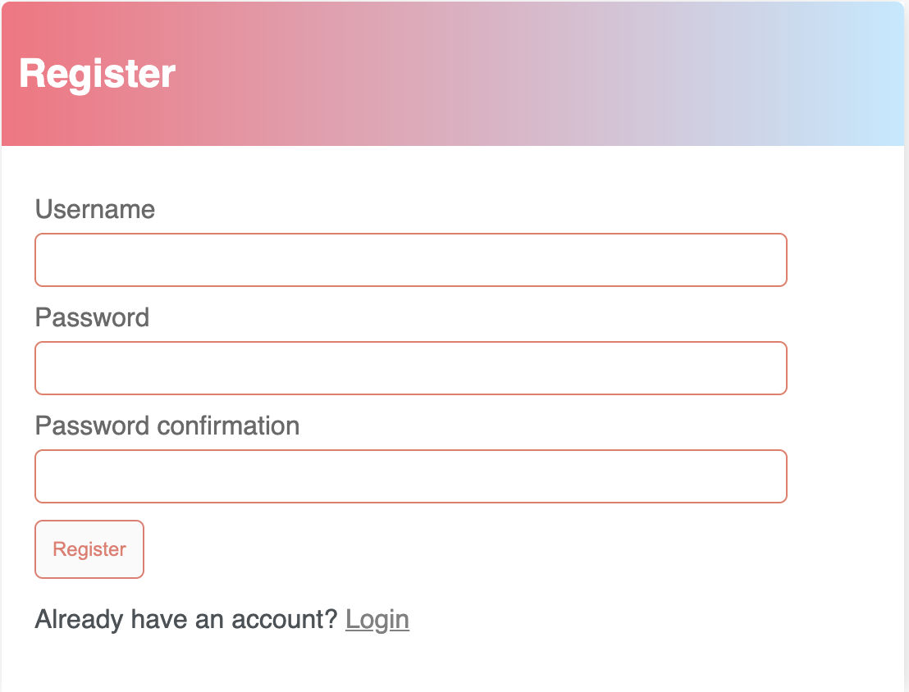

# Addressbook

### Requirements
##### Python >= 3.9 Django >= 4.0

### Steps to run the project on a mac

#### Cloning a repository
1. On GitHub.com, navigate to the main page of the repository.
2. Above the list of files, click the "Code" dropdown.
3. Copy the url.
4. Open Terminal.
5. Change the current working directory to the location where you want the cloned directory.
6. Type git clone, and then paste the URL you copied earlier. `$ git clone https://github.com/YOUR-USERNAME/YOUR-REPOSITORY`.
7. Press Enter to create your local clone. `Cloning into 'Addressbook'... remote: Enumerating objects: 71, done. remote: Counting objects: 100% (71/71), done. remote: Compressing objects: 100% (53/53), done. remote: Total 71 (delta 14), reused 70 (delta 13), pack-reused 0 Receiving objects: 100% (71/71), 30.05 KiB | 5.01 MiB/s, done. Resolving deltas: 100% (14/14), done.`

#### Create and start a virtual environment
1. Open your project in IDE.
2. cd into your project directory. `cd Addressbook/`
3. Make sure you have virtual env installed. Run `sudo pip install virtualenv` on the terminal if you dont.
4. Create a virtual env `virtualenv NAMEOFTHEVIRTUALENV`.
5. Activate virtual env `source NAMEOFTHEVIRTUALENV/bin/activate`.

#### Once the virtaul environment is activated
1. Install the requirements.txt file `pip install -r requirements.txt`. If you get an error, run `pip freeze > requirements.txt` first and then install the requirements.txt file.
2. Run `python manage.py runserver`.
3. Clink the link: `Starting development server at http://127.0.0.1:8000/`.
4. View the project.

#### Navigate through the project
1. Register an account with username and password.

2. Once registered, you will be logged in. Below is the home page you'll see.

3. Click the + icon on the right side to add a contact.

4. Once submitted, the user will be redirected to the landing page with contacts.

5. User can view full contact by clicking the view button.

6. User can edit contact fields by clicking the edit button.

7. User can delete the contact by clicking the delete button.

8. User can logout by clicking the Logout button on the top right corner

